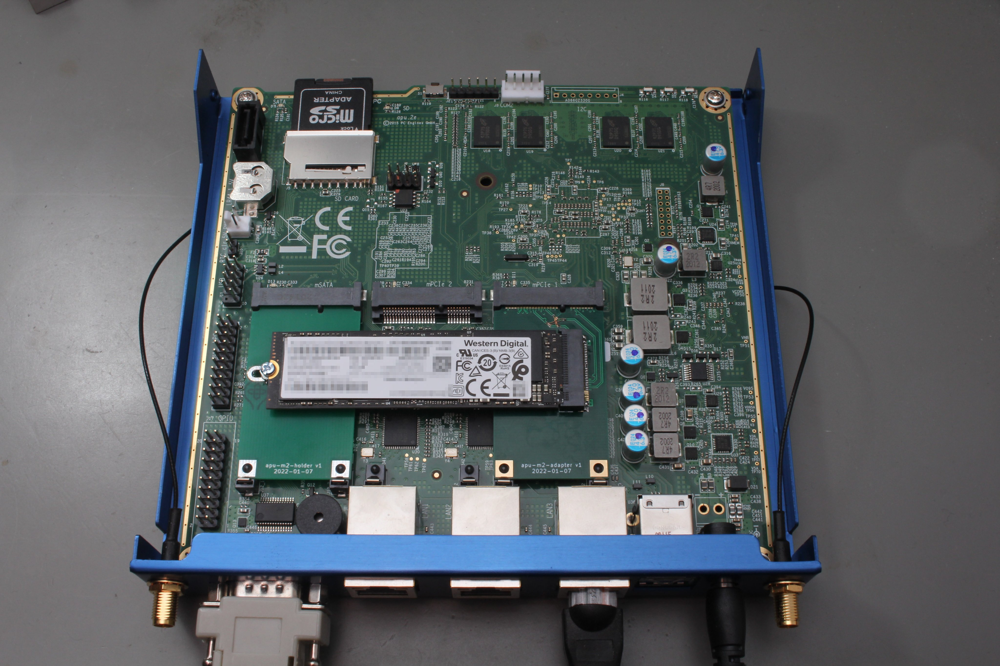
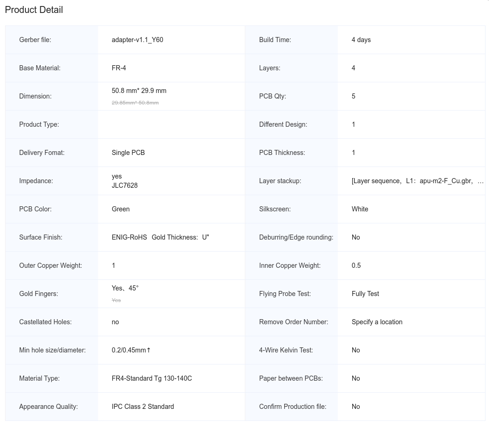
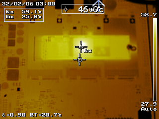

# apu-m2

This repo contains the hardware design for an adapter/holder combination that allows installing a 2280 M.2 NVMe SSD into a [PC Engines APU2](https://pcengines.ch/apu2.htm) board.

(This picture shows an older version of the design with some bodges applied, the version released here should just work out of the box, see [below](#revision-notes))

## Why?

The original apu2 board only allows SD cards/mSATA SSDs for storage. The former is not very performant/durable and the latter is getting rarer/more expensive per GB. There's also a regular SATA connector, but regular SATA SSDs don't fit well into the standard enclosure.

Conversely, M.2 SSDs are a staple piece of hardware nowadays. PCIe/NVMe is also a nicer interface compared to SATA (although raw throughput is approximately the same here, since we are trading SATA 3.0 for 1× PCIe Gen 2).

## Why not?

There's a number of downsides:

 - You lose 1 mPCIe slot (for the M.2 adapter) _and_ the mSATA slot (for the holder PCB)
 - You likely also lose the second mPCIe slot (which the M.2 card bridges over) depending on the height of the card you want to place in that slot
 - Cooling can be a concern (see [below](#cooling))

## Ordering

The adapter PCB is designed for the 4-layer [JLCPCB](https://jlcpcb.com) "JLC7628" stackup, with 1mm thickness:

The holder PCB is mainly mechanical, so there are no special requirements other than 1mm thickness.

The respective `fab/` directories contain the Gerber files that can be submitted to JLCPCB.

### Revision notes

Version 1.0 of the adapter PCB had the RX/TX lanes swapped because the mPCIe spec and the M.2 spec use different perspectives for describing the data transfer direction. Version 1.1, published here, fixes this and also adds some more assembly options for handshaking signals and additional decoupling. None of those are strictly necessary though, so the `DNP` annotations in the schematic reflect the electrical behavior of v1.0 (except for the RX/TX crossover), which has been working well in practice.

### BOM

For a minimal configuration, you only need:

 - 1× JAE SM3ZS067U410AMR1000 M.2 socket ([Digikey link](https://www.digikey.de/en/products/detail/jae-electronics/SM3ZS067U410AMR1000/4162231))
 - A mounting screw (I've used [these](https://www.amazon.de/gp/product/B087C1G4ZF), but "ASUS / ASROCK short M.2 screw" seems to be a good keyword in general)
 - 3× 0402 0 Ohm resistors (or just use a solder bridge)

## Software requirements

If you want to use the NVMe SSD as a boot drive, you'll need a recent version of the [APU coreboot firmware](https://pcengines.github.io/) (containing SeaBIOS 1.16.0 or newer), since a number of NVMe-related issues were only fixed recently.

## Cooling

At least in my experiments, the M.2 SSD got relatively hot (although I didn't compare this with the original mSATA SSD, so this could just be normal).

Internal monitoring (via `nvme smart-log`) showed temperatures exceeding 60 °C at an ambient air temperature of about 20 °C. This was a little too much for my taste, so I added a [Würth WE-TGFG](https://www.we-online.com/catalog/en/THERMAL_WE-TGFG) gasket (order number 407150015115) to bond the NVMe to the APU enclosure. With this, the temperature never exceeds 50 °C.
